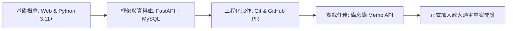

# 歡迎加入政大通後端團隊

> **「賦能每位學生,創造新的校園生活型態」**  
> 這是政大通（NCCUpass）的使命，也是每一行後端程式碼背後的核心價值。

---

## 關於這份手冊

恭喜你通過甄選加入 **政大通後端工程組**！

不論你目前只具備基本 Python 語法概念，或是剛接觸 Web 開發，這份手冊都是為你量身打造的起點。我們將透過 **漸進式學習資源** 與一個模擬真實敏捷開發的 **Onboarding Task（備忘錄 API 專案）**，陪伴你一步步掌握現代後端核心技術棧：

---

## 你的 Onboarding 目標

在完成這份指南後，你將具備以下能力：

1. **掌握現代 API 開發**：使用 **FastAPI** 獨立開發符合 RESTful 風格的 Web API。
2. **掌握資料庫與 ORM 操作**：透過 **SQLAlchemy** 與 **Alembic** 進行 MySQL 資料庫設計、關聯建立與資料庫遷移。
3. **掌握敏捷與工程協作流程**：熟悉 Git 分支策略、Commit 規範、Pull Request (PR) 流程與 Code Review 文化。
4. **具備良好程式碼素養**：理解分層架構（Layered Architecture）、Pydantic 請求驗證、錯誤處理與單元測試。

---

## 學習與任務路徑導覽

| 章節模組 | 主要內容 | 預估學習節奏 |
| :--- | :--- | :--- |
| [**關於團隊**](intro/culture.md) | 團隊文化、敏捷開發思維與新人第一週 Checklists | Day 1 |
| [**環境建置**](setup/git-github.md) | Git, SSH, Python 虛擬環境, VS Code, MySQL 連線工具 | Day 1 ~ 2 |
| [**學習資源**](roadmap/01-web-basics.md) | HTTP, Type Hints, FastAPI 核心, ORM 與 Git 工作流 | Week 1 |
| [**實戰任務**](task/overview.md) | 2 個 Sprint 實作「政大通備忘錄系統」 | Week 1 |
| [**API 規格書**](specs/memo-api.md) | 備忘錄系統之 RESTful API 端點與資料規格 | 隨時查閱 |
| [**團隊規範**](standards/git-commit.md) | Conventional Commits, PR 範本, 架構分層標準 | 隨時查閱 |
| [**常見問題**](faq.md) | 開發過程中常見錯誤與排除技巧 | 隨時查閱 |

---

## 遇到底層卡關或疑問

在政大通，主動提問是工程師最重要的軟實力之一。

- **Discord 頻道**：`#backend-dev` / `#onboarding-help`
- **你的 Mentor**：指派給你的後端組長或學長姐
- **求助守則**：請參考 [發問的藝術與提問範本](intro/culture.md#asking-for-help)

現在，請從 [團隊文化與敏捷思維](intro/culture.md) 開始探索！
