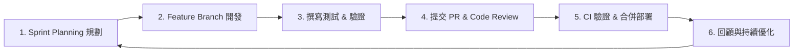

# 團隊文化與敏捷思維

政大通後端組不僅注重「把功能做出來」，更在乎 **程式碼品質、團隊溝通與工程效率** 。理解我們的協作哲學，能讓你在團隊裡工作得更加順暢且愉快。

---

## 為什麼採用敏捷開發（Agile / Scrum）？

在政大通，我們採用輕量化的敏捷開發模式：



### 核心原則
1. **小步快跑（Small Incremental Steps）**：不把所有功能堆積到最後一次性交付，而是拆解成 1~2 天即可完成的小任務（User Stories）。
2. **頻繁溝通（Frequent Communication）**：隨時在 Discord 同步進度與 blocker（阻礙），有問題當天提出。
3. **持續整合（Continuous Integration）**：每次發起 PR 都會觸發自動化測試，確保不破壞既有功能。

---

## Code Review 的精神

在政大通，**Code Review 不是考試，而是學習與知識交流的過程**。

- **對事不對人**：Review 針對的是程式碼設計、可讀性與效能，而非個人能力。
- **共同承擔**：一旦程式碼被 Review 並合併進 `main`，這份程式碼就是全團隊共同負責的。
- **互相學習**：不管是資深還是新人，每個人都能從 Review 別人的程式碼中學到新的寫法與思路。

---

## 發問的藝術（How to Ask Questions）<a id="asking-for-help"></a>

當你在設定環境或寫 code 遇到 Bug 卡住超過 **1天** 而毫無進展時，請務必主動尋求協助！提問時請盡量遵循 **3W 原則**：

```text
【提問範本】
1. What I want to do (我原本想達成什麼目標)：
   想要執行 `uvicorn main:app --reload` 啟動服務。

2. What happened (實際發生了什麼，包含完整報錯訊息)：
   終端機跳出 `sqlalchemy.exc.OperationalError: (pymysql.err.OperationalError) (2003, "Can't connect to MySQL server")`

3. What I have tried (我已經嘗試過哪些方法與推測)：
   - 確認過 .env 中的 DB_PORT 是 3306
   - 檢查過 DBeaver 可以連上，但 Python 程式碼連不上
   - 附上相關設定檔代碼片段或截圖
```

> [!TIP]
> 附上「完整的錯誤訊息（Traceback）」和「你做過的嘗試」，能讓學長姐在短時間內幫你精準定位問題！
