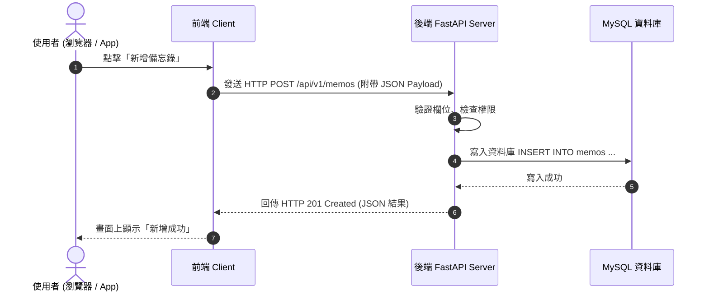

# 01. Web 與 HTTP 基礎

在進入後端框架之前，讓我們先建立對 Web 運作方式的直覺理解。

---

## 什麼是 Client-Server 架構？

後端開發的核心，就是在處理「客戶端（Client）」與「伺服器端（Server）」之間的溝通：



---

## HTTP 協議的三大要素

每一次 HTTP 溝通，都由 **Request（請求）** 與 **Response（回應）** 組成。

### 1. HTTP 請求方法（Methods）與 RESTful 原則

在 RESTful API 設計規範中，不同動作對應特定的 HTTP Method：

| Method | 中文意義 | 對應 CRUD 動作 | 冪等性（Idempotent） | 使用情境範例 |
| :--- | :--- | :--- | :--- | :--- |
| **GET** | 取得 | Read | 是 | 查詢備忘錄列表、取得單一備忘錄 |
| **POST** | 新增 | Create | 否 | 建立新備忘錄、使用者註冊/登入 |
| **PUT** | 完整替換 | Update | 是 | 覆蓋更新整筆備忘錄所有欄位 |
| **PATCH** | 部分更新 | Update | 否/是 | 僅修改備忘錄的標題或完成狀態 |
| **DELETE**| 刪除 | Delete | 是 | 刪除指定 ID 的備忘錄 |

### 2. HTTP 狀態碼（Status Codes）

伺服器處理完畢後，會回傳 3 位數的狀態碼：

- **`2xx` 成功（Success）**
    - `200 OK`：一般的讀取或修改成功。
    - `201 Created`：資源建立成功（例如 POST 新增成功）。
    - `204 No Content`：成功處理但沒有回傳內容（常用於 DELETE 成功）。
- **`4xx` 客戶端錯誤（Client Error）**
    - `400 Bad Request`：請求格式不符或參數缺失。
    - `401 Unauthorized`：未帶 Token 或 Token 驗證失敗（未登入）。
    - `403 Forbidden`：已登入但沒有權限操作此資源（例如試圖修改別人的備忘錄）。
    - `404 Not Found`：找不到請求的資源（例如指定的 Memo ID 不存在）。
    - `422 Unprocessable Entity`：FastAPI 專屬，Pydantic 欄位型別驗證失敗。
- **`5xx` 伺服器端錯誤（Server Error）**
    - `500 Internal Server Error`：後端程式碼發生未捕獲的例外（Exception/Crash）。

### 3. JSON 資料格式

後端與前端資料交換幾乎全面使用 **JSON (JavaScript Object Notation)**：

```json
{
  "id": 1,
  "title": "複習微積分期中考",
  "content": "算完第 3 章至第 5 章習題",
  "is_completed": false,
  "priority": 5,
  "tags": ["課業", "政大通"]
}
```

---

## 外部推薦優質資源
- [MDN Web Docs: HTTP 概述 (繁中)](https://developer.mozilla.org/zh-TW/docs/Web/HTTP/Overview)
- [RESTful API 設計指南 (簡中)](https://www.ruanyifeng.com/blog/2014/05/restful_api.html)
- [CS50 - HTTP & Web Basics (YouTube)](https://www.youtube.com/results?search_query=CS50+HTTP)
