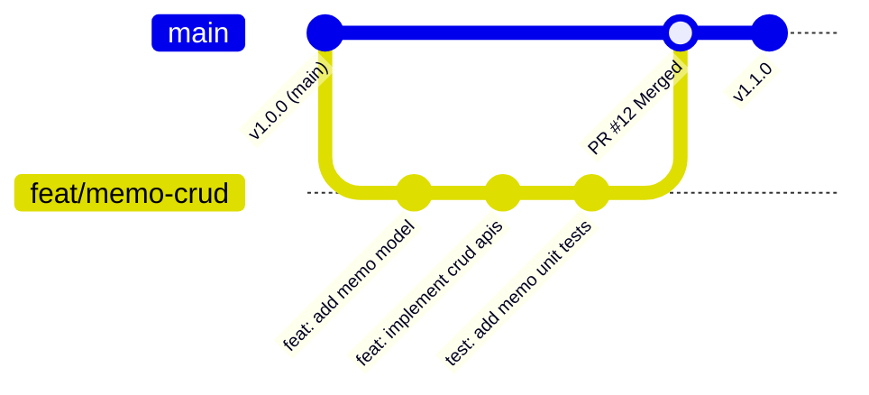

# 05. Git 協作與 PR 工作流

在團隊開發中，我們絕對不會直接把程式碼 commit 到 `main` 分支。本篇將介紹政大通採用的 **GitHub Flow** 工作流程。

---

## 1. GitHub Flow 標準分支生命週期



### 完整流程步驟：
1. **更新本地 `main` 分支**：確保拿到最新程式碼。
2. **開新分支（Feature Branch）**：從 `main` 切出一條新分支，命名格式通常為 `feat/功能名稱` 或 `fix/修復名稱`。
3. **小步 Commit**：遵循 [Conventional Commits](../standards/git-commit.md) 規範。
4. **推送到遠端（Push）**：`git push origin feat/xxx`。
5. **在 GitHub 發起 Pull Request (PR)**：填寫 PR 描述與修改動機。
6. **Code Review 與修改**：組長/夥伴給予建議，在本地修改後直接 push 更新 PR。
7. **CI 測試通過並 Merge**。

---

## 2. 日常指令速查表

### 步驟 A：從 main 開始新功能
```bash
# 1. 切換到 main 並拉取最新代碼
git checkout main
git pull origin main

# 2. 開立並切換到新分支 (例如實作備忘錄新增功能)
git checkout -b feat/add-memo-api
```

### 步驟 B：撰寫程式碼並提交
```bash
# 查看變更狀態
git status

# 將變更加入暫存區
git add .

# 遵循 Conventional Commits 撰寫 commit 訊息
git commit -m "feat(memo): add create memo endpoint with pydantic validation"
```

### 步驟 C：推送到 GitHub 並建立 PR
```bash
# 第一次推送時指定 upstream
git push -u origin feat/add-memo-api
```
推送成功後，終端機會貼心地印出一條建立 PR 的網址，點擊即可前往 GitHub 發起 PR。

---

## 3. 遇到衝突（Merge Conflict）怎麼辦？

當別人比你先合併程式碼到 `main` 時，你的分支可能會產生衝突：

```bash
# 1. 切回 main 並拉取最新代碼
git checkout main
git pull origin main

# 2. 切回你的開發分支並進行 rebase 或 merge
git checkout feat/add-memo-api
git merge main

# 3. 開啟 VS Code 解決有標記 <<<<<<< HEAD 的衝突檔案
# 4. 解決後加入暫存區並提交
git add .
git commit -m "chore: resolve merge conflicts with main"
git push origin feat/add-memo-api
```

---

## 外部推薦優質資源 (施工中)
- [為你自己學 Git (高見龍老師經典繁中教學)](https://gitbook.tw/)
- [Learn Git Branching (視覺化互動闖關遊戲)](https://learngitbranching.js.org/?locale=zh_TW)
