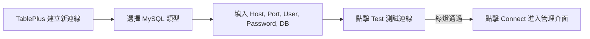

# 資料庫連線與管理工具

在政大通的專案中，我們主要使用 **MySQL 8.0** 作為關聯式資料庫。

在 Onboarding 階段，團隊已經為你建置好開發測試用的資料庫服務；若你想在自己電腦本地啟動 MySQL，我們也提供了 Docker 一鍵啟動指令。

---

## 1. 取得團隊開發資料庫連線資訊

請向你的 Mentor 或在 Discord `#onboarding-help` 索取個人專屬的連線帳密，格式通常如下：

```dotenv
# .env 範例格式
DB_HOST=dev-db.nccupass.internal  # 或團隊提供的測試主機 IP / localhost
DB_PORT=3306
DB_USER=nccu_onboarding_user
DB_PASSWORD=your_secure_password
DB_NAME=nccu_memo_db
```

---

## 2. 推薦 GUI 資料庫工具：TablePlus

我們強烈推薦安裝 **[TablePlus](https://tableplus.com/)**。它具備現代輕量、介面極簡、原生高效能的特點，非常適合新手視覺化瀏覽資料表與對照除錯。

### TablePlus 連線步驟教學

1. 前往 [TablePlus 官方網站](https://tableplus.com/) 下載並安裝（支援 macOS 與 Windows）。
2. 開啟 TablePlus，點擊首頁的 **Create a new connection...**（或快捷鍵 `Ctrl + N` / `Cmd + N`）。
3. 選擇 **MySQL** 作為資料庫類型，點擊 **Create**。
4. 依序填入連線參數：
   - **Name**：自行命名（例如 `NCCUpass Dev DB`）
   - **Host / Socket**：填入 `DB_HOST`（本地端通常為 `127.0.0.1` 或 `localhost`）
   - **Port**：`3306`
   - **User**：填入 `DB_USER`
   - **Password**：填入 `DB_PASSWORD`
   - **Database**：填入 `DB_NAME`（例如 `nccu_memo_db`）
   - **SSL**：預設選 `preferred` 或 `disable`
5. 點擊右下角 **Test** 按鈕：
   - 若顯示各欄位為綠色，代表連線成功！
   - 若顯示紅色，請檢查帳號、密碼或 Host 是否有打錯。
6. 點擊 **Connect** 連線進入資料庫。



### TablePlus 核心功能與除錯小技巧

- **檢視資料與切換表格**：按快捷鍵 `Ctrl + P` (Windows) 或 `Cmd + P` (macOS) 可快速搜尋並切換到 `memos` 表格。
- **重新整理資料**：當你用 API 新增或修改資料後，按 `Ctrl + R` / `Cmd + R` 即可即時重新載入最新資料。
- **開啟 SQL 編輯器**：按 `Ctrl + E` / `Cmd + E` 可打開 SQL Query 視窗，直接撰寫原生 SQL 語句進行查詢與測試。
- **手動編輯與復原**：雙擊格子可直接修改數值，修改後需按 `Ctrl + S` / `Cmd + S` 存檔；若想放棄修改按 `Ctrl + Z`。

---

## 3. 替代 GUI 工具：DBeaver (選用)

如果你習慣使用免費開源的 **[DBeaver Community](https://dbeaver.io/)**，也是非常穩定的選擇：

1. 下載並安裝 DBeaver。
2. 點擊左上角 **新連線 (Plug icon)** -> 選擇 **MySQL**。
3. 填入 Host、Database、Username 與 Password。
4. 點擊 **Test Connection**（若提示需下載驅動程式請點擊 Download）。
5. 測試成功後點擊 **Finish** 即可。

---

## 4. 備用方案：使用 Docker 在本地啟動 MySQL (選配)

如果你想在完全離線或自己電腦上獨立跑 MySQL，可以在專案中建立 `docker-compose.yml`：

```yaml
version: '3.8'

services:
  db:
    image: mysql:8.0
    container_name: nccupass_mysql
    restart: always
    environment:
      MYSQL_ROOT_PASSWORD: rootpassword
      MYSQL_DATABASE: nccu_memo_db
      MYSQL_USER: nccu_user
      MYSQL_PASSWORD: nccu_password
    ports:
      - "3306:3306"
    volumes:
      - mysql_data:/var/lib/mysql

volumes:
  mysql_data:
```

在終端機執行一行指令啟動：
```bash
docker compose up -d
```
即可在本地 `localhost:3306` 擁有完整的 MySQL 8.0 環境！
