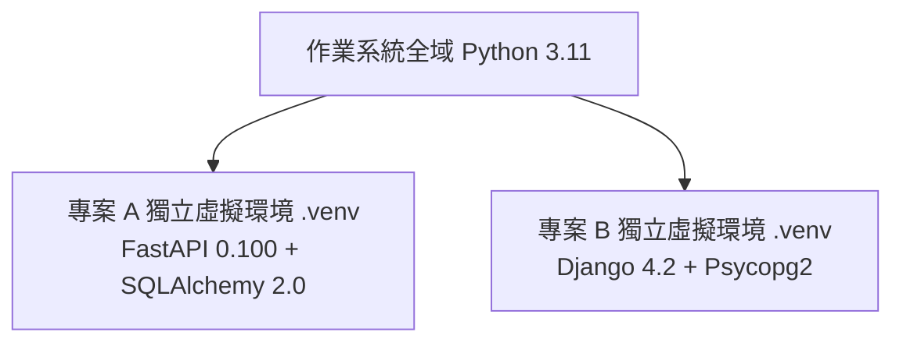

# Python 開發環境與虛擬環境

政大通後端專案目前採用 **Python 3.11+** 開發。本篇將引導你建立乾淨、隔離的 Python 開發環境。

---

## 1. 安裝 Python 3.11 或更高版本

請確保安裝 Python 3.11 ~ 3.12 版本（推薦 3.11+，以取得最佳型別支援與執行效能）。

=== "Windows"
    1. 前往 [Python 官方下載頁面](https://www.python.org/downloads/)。
    2. 下載 Python 3.11+ 安裝程式。
    3. > [!IMPORTANT]
       > 安裝畫面務必勾選 **Add python.exe to PATH**！
    4. 開啟 PowerShell 輸入：
    ```powershell
    python --version
    ```

=== "macOS"
    推薦使用 Homebrew 安裝：
    ```bash
    brew install python@3.11
    ```

---

## 2. 為什麼需要「虛擬環境（Virtual Environment）」？

在 Python 開發中，不同的專案可能會使用不同版本的套件（例如專案 A 用 FastAPI 0.95，專案 B 用 FastAPI 0.110）。
如果不隔離，所有套件都會安裝在電腦的全域目錄中，容易發生版本衝突並搞亂系統環境。

**虛擬環境的作用**：為每一個專案在專案資料夾內創建獨立的 Python 執行檔與套件目錄（通常命名為 `.venv`）。



---

## 3. 虛擬環境標準操作指南（`venv`）

### 步驟 A：建立虛擬環境
進入你的專案目錄，執行：
```bash
python -m venv .venv
```
這會在當前目錄下建立一個名為 `.venv` 的資料夾。

### 步驟 B：啟動虛擬環境
=== "Windows (PowerShell)"
    ```powershell
    .venv\Scripts\Activate.ps1
    ```
    > [!TIP]
    > 若跳出「因為這個系統上已停用指令碼執行...」的安全性錯誤，請以管理員身分開啟 PowerShell 執行：  
    > `Set-ExecutionPolicy RemoteSigned -Scope CurrentUser`

=== "Windows (Command Prompt / cmd)"
    ```cmd
    .venv\Scripts\activate.bat
    ```

=== "macOS / Linux"
    ```bash
    source .venv/bin/activate
    ```

啟動成功後，終端機指令提示字元前方會出現 `(.venv)` 前綴，例如：
```text
(.venv) PS D:\my-fastapi-app>
```

### 步驟 C：安裝套件與記錄依賴
在啟動的虛擬環境中安裝套件：
```bash
# 安裝單一套件
pip install fastapi uvicorn

# 根據 requirements.txt 一鍵安裝所有依賴
pip install -r requirements.txt

# 輸出目前虛擬環境中所有套件清單
pip freeze > requirements.txt
```

### 步驟 D：退出虛擬環境
當開發完畢要離開時，只需輸入：
```bash
deactivate
```
