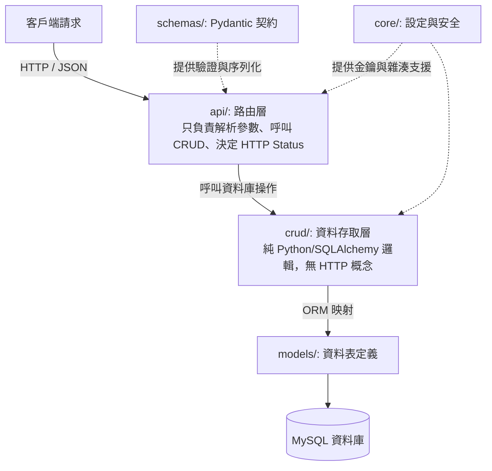

# FastAPI 專案分層架構規範

政大通後端專案統一採用 **分層架構（Layered Architecture）**，將各個模組職責清晰分離，確保專案具備高可讀性、易測試性與可擴展性。

---

## 標準分層結構概覽

```text
nccupass-memo-service/
├── app/
│   ├── api/                     # 1. 路由層 (Controllers / Presentation Layer)
│   │   ├── deps.py              # 共用依賴注入 (get_db, get_current_user)
│   │   └── v1/
│   │       ├── api.py           # v1 總路由整合
│   │       └── endpoints/
│   │           ├── auth.py      # 認證相關端點
│   │           └── memos.py     # 備忘錄相關端點
│   ├── core/                    # 2. 核心設定層 (Core Config & Security)
│   │   ├── config.py            # 環境變數載入 (Pydantic Settings)
│   │   ├── security.py          # 密碼雜湊 (bcrypt) 與 JWT 生成/解析
│   │   └── exceptions.py        # 自訂例外類別
│   ├── crud/                    # 3. 資料存取層 (Data Access Layer / Repository)
│   │   ├── crud_user.py         # 使用者資料庫操作 (Query / Insert / Update)
│   │   └── crud_memo.py         # 備忘錄資料庫操作
│   ├── models/                  # 4. ORM 模型層 (Database Models)
│   │   ├── base.py              # SQLAlchemy Base
│   │   ├── user.py              # User Table ORM Class
│   │   └── memo.py              # Memo Table ORM Class
│   ├── schemas/                 # 5. 資料傳輸與驗證層 (DTO / Pydantic Schemas)
│   │   ├── common.py            # 統一 API 回應格式 (ResponseWrapper)
│   │   ├── user.py              # UserCreate, UserResponse
│   │   └── memo.py              # MemoCreate, MemoUpdate, MemoResponse
│   ├── database.py              # 資料庫 Engine & SessionLocal
│   └── main.py                  # FastAPI 主程式入口與 Middleware 設定
├── tests/                       # 6. 自動化測試層 (Automated Tests)
│   ├── conftest.py              # 測試 fixtures
│   ├── test_auth.py
│   └── test_memos.py
├── alembic/                     # 資料庫遷移腳本
├── .env.example
├── requirements.txt
└── README.md
```

---

## 各層職責與相依規則



### 關鍵守則：
1. **Router 不寫複雜 SQL 查詢**：所有的 `db.query(Memo)...` 一律封裝在 `crud/` 模組中。
2. **CRUD 不碰 HTTP 概念**：`crud` 函式內不要拋出 `HTTPException`，而是回傳 `None` 或拋出自訂的業務例外，由 Router 或全域 Exception Handler 決定回傳什麼狀態碼。
3. **敏感資訊絕不外流**：`UserResponse` Schema 絕對不可以包含 `hashed_password` 欄位。
