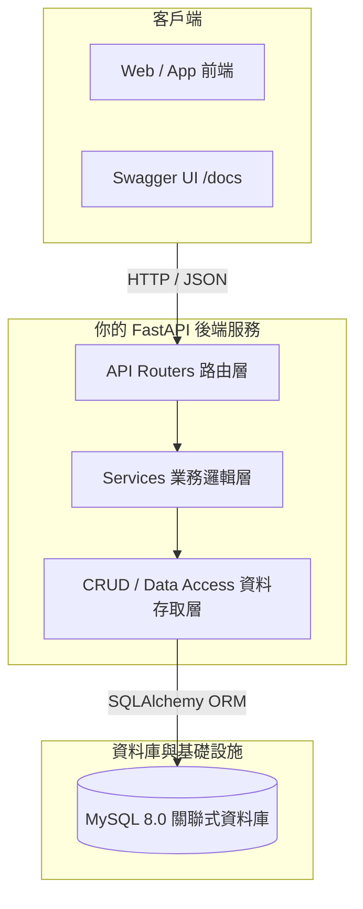

# Onboarding Task：政大通備忘錄系統 (Memo Service)

歡迎來到後端組的實戰演練任務！這個任務被設計成一個迷你但完整的微服務專案，模擬真實產品開發的每一個環節。

---

## 專案背景與需求場景

政大通 App 預計推出新功能「政大個人備忘錄 / 代辦事項」，讓政大學生可以記錄隨手靈感、待繳作業或重要校園日程。身為後端工程師，你的任務是從無到有打造提供給前端使用的 RESTful API 服務。

---

## 敏捷 Sprint 里程碑規劃

我們將專案拆解為 5 個循序漸進的 Sprint，每個 Sprint 都有明確的驗收標準（Acceptance Criteria）：

| Sprint | 主題名稱 | 核心學習與交付成果 |
| :--- | :--- | :--- |
| **[Sprint 1](sprint-1.md)** | **環境與資料模型** | 專案初始化、連線 MySQL、建立 Memo 資料表與 Alembic 遷移 |
| **[Sprint 2](sprint-2.md)** | **CRUD 核心 API** | 實作備忘錄的建立、查詢列表、單筆查詢、更新狀態與刪除 |
| **[Sprint 3](sprint-3.md)** | **驗證與例外處理** | 欄位字數/邊界檢查、自訂例外與全域統一 JSON 錯誤回應 |
| **[Sprint 4](sprint-4.md)** | **認證與使用者隔離** | 使用者註冊登入、密碼雜湊、JWT 驗證、確保只能存取自己的備忘錄 |
| **[Sprint 5](sprint-5.md)** | **測試與繳交 PR** | 使用 pytest 撰寫自動化測試、設定 GitHub Actions、提交 PR |

---

## 任務繳交與驗收方式

1. **獨立 Repository**：請在你的個人 GitHub 帳號或政大通指定 repo 建立新專案（例如 `nccupass-memo-service`）。
2. **遵守分支與 Commit 規範**：每個 Sprint 開發一個分支（例如 `feat/sprint-1-db-model`）。
3. **完成後發起 PR**：發起 PR 並 Tag 你的 Mentor，在 PR 描述中貼上測試結果或 Swagger 截圖。
4. **Code Review 回饋交流**：Mentor 會給予程式碼架構與優化建議，討論並修改完成後即算過關！
