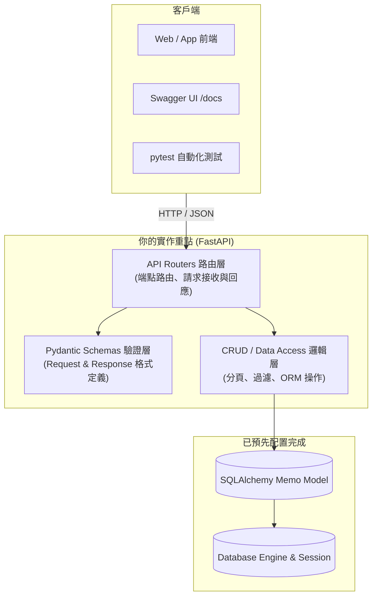

# Onboarding Task：政大通備忘錄系統 (Memo Service)

歡迎來到後端組的實戰演練任務！這個任務被設計成一個聚焦於 API 開發、業務邏輯與測試的實戰專案。

---

## 專案背景與需求場景

政大通 App 預計推出新功能「政大個人備忘錄 / 代辦事項」，讓政大學生可以記錄隨手靈感、待繳作業或重要校園日程。

為了讓大家能直接專注在 **API 設計**、**Pydantic 資料轉換**、**業務邏輯處理** 與 **自動化測試**，專案的**資料庫模型（SQLAlchemy Model）與連線設定（Database Engine / Session）已經由團隊預先配置好**。你的任務是接續完成各項 RESTful API 端點與對應的 CRUD 存取邏輯。

---

## 敏捷 Sprint 里程碑規劃

我們將任務拆解為 2 個循序漸進的 Sprint：

| Sprint | 主題名稱 | 核心學習與交付成果 |
| :--- | :--- | :--- |
| **[Sprint 1](sprint-1.md)** | **基礎 CRUD API 與 Schemas 實作** | 定義基礎 Pydantic 模型、實作建立/單筆查詢/刪除端點、撰寫基礎單元測試 |
| **[Sprint 2](sprint-2.md)** | **列表過濾、進階業務邏輯與完整測試** | 實作分頁列表、完成狀態篩選、關鍵字搜尋、部分更新（PATCH）與完整測試 |

---

## 任務繳交與驗收方式

1. **Clone Starter 專案**：從團隊提供的 Starter 範本 Repository 開始開發。
2. **遵守分支與 Commit 規範**：依據 Sprint 開發分支（例如 `feat/sprint-1-basic-api`、`feat/sprint-2-list-and-update`）。
3. **完成後發起 PR**：發起 PR 並 Tag 你的 Mentor，在 PR 描述中附上 `pytest` 綠燈截圖或 Swagger `/docs` 測試結果。
4. **Code Review 回饋交流**：Mentor 會給予程式碼架構與優化建議，討論並修改完成後即算過關！
