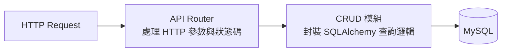

# Sprint 2 - CRUD 核心 API 實作

> **Sprint 目標**：實作備忘錄完整的 CRUD（Create, Read, Update, Delete）業務邏輯，並體會清晰的分層架構。

---

## 任務清單 (Task Checklist)

- [ ] 在 `schemas/memo.py` 中定義請求與回應的 Pydantic 模型（`MemoCreate`, `MemoUpdate`, `MemoResponse`）
- [ ] 在 `crud/memo.py` 封裝資料庫查詢與操作邏輯
- [ ] 在 `api/v1/endpoints/memos.py` 撰寫 FastAPI 路由
- [ ] 實作 `POST /api/v1/memos`（新增備忘錄，回傳 `201 Created`）
- [ ] 實作 `GET /api/v1/memos`（支援分頁 `skip`, `limit` 與完成狀態過濾 `is_completed`）
- [ ] 實作 `GET /api/v1/memos/{id}`（取得特定備忘錄，找不到時回傳 `404 Not Found`）
- [ ] 實作 `PATCH /api/v1/memos/{id}`（更新備忘錄內容或完成狀態）
- [ ] 實作 `DELETE /api/v1/memos/{id}`（刪除備忘錄，回傳 `204 No Content`）

---

## 分層架構實作思維

我們強烈建議遵守 **Router -> Service/CRUD -> Model** 的職責分離：



### 1. Pydantic Schemas 設計 (`app/schemas/memo.py`)

```python
from datetime import datetime
from pydantic import BaseModel, ConfigDict, Field

# 基礎共用欄位
class MemoBase(BaseModel):
    title: str = Field(..., min_length=1, max_length=100)
    content: str | None = None
    priority: int = Field(default=1, ge=1, le=5)

# 建立請求
class MemoCreate(MemoBase):
    pass

# 部分更新請求 (欄位皆為選填)
class MemoUpdate(BaseModel):
    title: str | None = Field(None, min_length=1, max_length=100)
    content: str | None = None
    is_completed: bool | None = None
    priority: int | None = Field(None, ge=1, le=5)

# 回應格式 (將 ORM Model 轉成 JSON)
class MemoResponse(MemoBase):
    id: int
    is_completed: bool
    created_at: datetime
    updated_at: datetime

    model_config = ConfigDict(from_attributes=True)
```

---

## 驗收條件 (Acceptance Criteria)

1. 開啟 `/docs` Swagger UI 能夠依序測試：
   - 建立 3 筆備忘錄
   - 呼叫 `GET /api/v1/memos?is_completed=false` 只查出未完成項目
   - 呼叫 `PATCH /api/v1/memos/{id}` 將其中一筆標記為 `is_completed: true`
   - 呼叫 `DELETE /api/v1/memos/{id}` 刪除一筆，再次查詢該 ID 會得到 404
2. 程式碼無未處理之異常崩潰。
