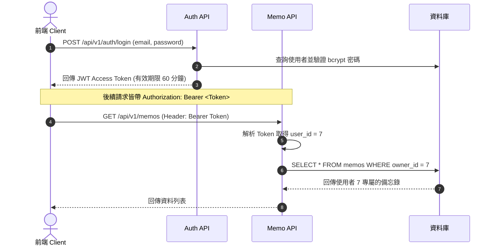

# Sprint 4 - JWT 認證與使用者資料隔離

> **Sprint 目標**：建立使用者註冊與登入系統，透過 JWT (JSON Web Token) 識別身分，確保每位使用者「只能查看、編輯與刪除自己的備忘錄」。

---

## 任務清單 (Task Checklist)

- [ ] 新增 `User` 資料模型（包含 `id`, `email`, `hashed_password`, `username`, `created_at`）
- [ ] 在 `Memo` 模型中建立外鍵關聯 `owner_id = Column(Integer, ForeignKey("users.id"))`
- [ ] 安裝安全套件：`passlib[bcrypt]`, `pyjwt`
- [ ] 實作密碼雜湊與比對函式（使用 `bcrypt`）
- [ ] 實作 `POST /api/v1/auth/register`（註冊新帳號）
- [ ] 實作 `POST /api/v1/auth/login`（登入並簽發 JWT Access Token）
- [ ] 撰寫 `get_current_user` 依賴注入函式，解析 Header 中的 Bearer Token
- [ ] 重構 Memo CRUD API：將查詢與寫入綁定至 `current_user.id`

---

## 核心架構：JWT 身分認證流

---

## 驗收條件 (Acceptance Criteria)

1. 註冊兩個使用者（例如 User A 與 User B）。
2. User A 登入取得 Token A，並建立 2 筆備忘錄。
3. User B 登入取得 Token B：
   - 呼叫 `GET /api/v1/memos` 看到列表為空（看不到 User A 的備忘錄）。
   - 嘗試呼叫 `DELETE /api/v1/memos/{A的備忘錄ID}` 會收到 `403 Forbidden` 或 `404 Not Found`。
4. 未帶 Token 請求受保護的 API 時，回傳 `401 Unauthorized`。
